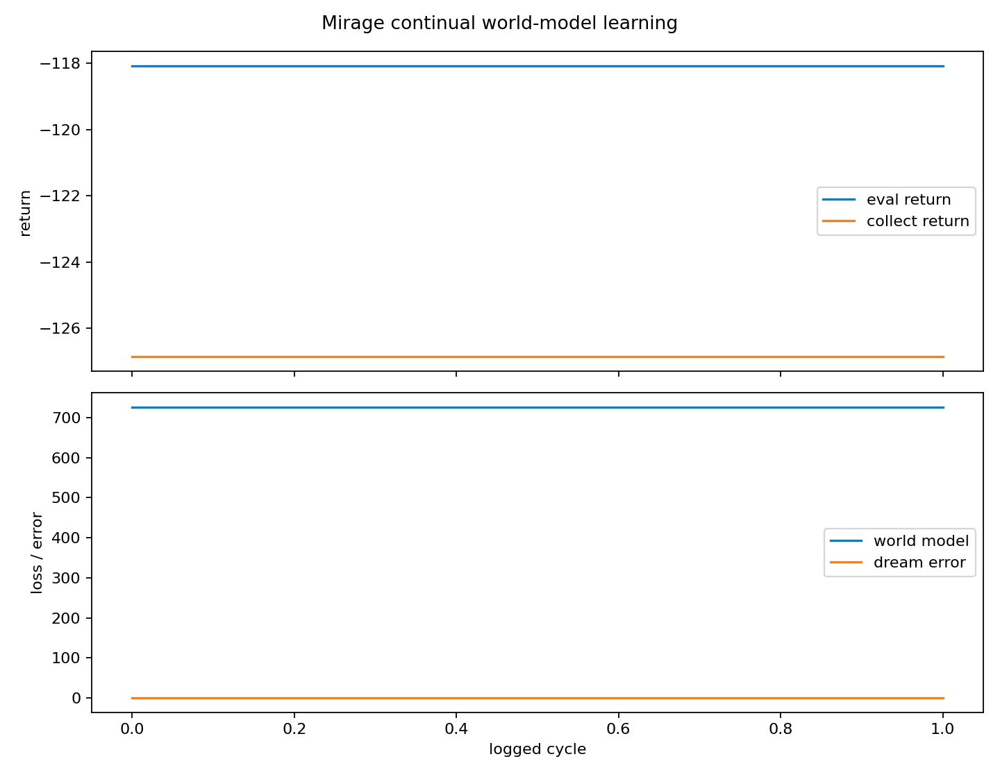
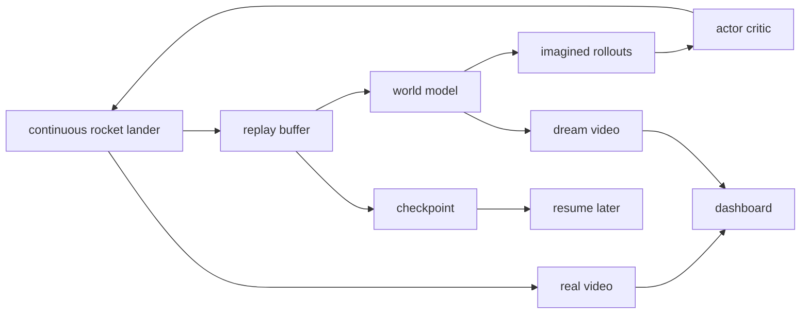

# Mirage

Mirage is a pure-PyTorch research lab for a small but serious world-model thesis:

> A persistent agent should learn a compact internal simulator, dream futures inside it, and use those dreams to improve real-world control.

The v1 environment is a continuous-control rocket lander. Mirage learns from low-dimensional physics state for reliability, but renders real and imagined rollouts so the learning process is visible. It is not an AGI claim. It is a falsifiable local experiment in continual model-based reinforcement learning.

## What It Builds

- A continuous rocket-lander wrapper using Gymnasium LunarLander when Box2D is available, with a deterministic NumPy fallback.
- A Dreamer-lite agent: state encoder, recurrent latent dynamics, reward/continuation heads, actor, critic, and imagined-rollout training.
- A resumable daemon loop: act, remember, train the world model, dream, train the policy, evaluate, checkpoint.
- A local web dashboard showing phase, metrics, replay size, real rollout video, and dreamed rollout video.

## Quickstart

```bash
uv sync
uv run mirage daemon --cycles 1 --config configs/smoke.yaml
uv run mirage dashboard --once
uv run mirage plot --runs runs/
```

Run a longer local Apple Silicon experiment:

```bash
uv run mirage daemon --minutes 60 --config configs/local_mps.yaml
uv run mirage dashboard
```

Then open:

```text
http://127.0.0.1:8765
```

## Commands

```bash
uv run mirage daemon --minutes 60
uv run mirage train --cycles 10
uv run mirage eval --checkpoint runs/<run>/checkpoints/latest.pt
uv run mirage dashboard
uv run mirage demo
uv run mirage plot --runs runs/
```

## Artifacts

Each run writes:

```text
runs/<run>/
  config.json
  metrics.jsonl
  dashboard_state.json
  runner_state.json
  checkpoints/
    latest.pt
    replay.npz
  videos/
    real.mp4
    dream.mp4
```

The key metrics are episode return, landing success rate, world-model loss, reward loss, imagined value, dream-to-real error, replay size, wall-clock time, and parameter count.

## Smoke Result Snapshot

The committed `results/` artifacts come from a one-cycle smoke run on Apple MPS with the deterministic NumPy lander backend. This is a reproducibility check, not a performance claim.



| Run | Backend | Steps | Eval return | Landing success | World-model loss | Dream-to-real error | Parameters |
| --- | --- | ---: | ---: | ---: | ---: | ---: | ---: |
| `smoke-20260502-124017` | `numpy` | 80 | -118.08 | 0.00 | 725.46 | 0.137 | 46,287 |

## Architecture



## Research Positioning

Mirage is inspired by:

- [DreamerV3: Mastering Diverse Domains through World Models](https://arxiv.org/abs/2301.04104)
- [TD-MPC2: Scalable, Robust World Models for Continuous Control](https://arxiv.org/abs/2310.16828)
- [Gymnasium LunarLander](https://gymnasium.farama.org/environments/box2d/lunar_lander/)

Mirage v1 is intentionally smaller than those systems. The goal is inspection and reproducibility, not state-of-the-art performance.

## Continuous Learning

Mirage is continuous in the durable-state sense:

- it checkpoints the agent, world model, replay memory, metrics, and dashboard state;
- it can resume from `runs/<run>/checkpoints/latest.pt`;
- it can run in budgeted sessions, stop, and continue later without forgetting.

This avoids wasting compute while preserving long-term learning progress.

## Limitations

- v1 learns from state, not raw pixels.
- The NumPy fallback lander is a small research environment, not Box2D physics.
- Dreamer-lite is not a full DreamerV3 reproduction.
- Good landings may require longer runs and tuning.
- The dashboard is local-only by design.

## Tests

```bash
uv run pytest
```

The tests cover deterministic environment behavior, replay persistence, model shape contracts, checkpoint load/save, CLI help, dashboard state, and one smoke daemon cycle.
